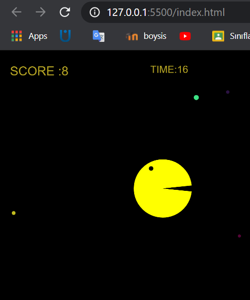

# Pacman-P5

Welcome to the Pacman-P5 project! This is a fun and interactive implementation of the classic Pacman game using the p5.js library. The game allows players to control Pacman using the arrow keys, navigate through the maze, and collect dots while avoiding obstacles.

## Live Demo

You can play the game live at the following link: [Pacman Live Demo](https://pacman-p5-ilt8yrwri-enginkaratas-projects.vercel.app/)

## How to Play

- Use the arrow keys on your keyboard to move Pacman around the screen.
- Collect dots to increase your score.
- Try to reach a score of 50 to win the game!

## Features

- Interactive gameplay with real-time score tracking.
- Colorful graphics and animations.
- Easy to understand and modify code for learning purposes.

## Getting Started

To run the game locally, follow these steps:

1. Clone the repository:
   ```
   git clone https://github.com/EnginKARATAS/pacman-p5.git
   ```

2. Navigate to the project directory:
   ```
   cd pacman-p5
   ```

3. Open `index.html` in your web browser to start playing.

## Contributing

Contributions are welcome! If you have suggestions for improvements or new features, feel free to open an issue or submit a pull request.

## License

This project is licensed under the MIT License. See the [LICENSE](LICENSE) file for details.

## Acknowledgments

Special thanks to the creators of p5.js for providing an excellent framework for creative coding.



you can see advanced pacman game in 

https://github.com/EnginKARATAS/pacman-eats-questions-p5

 
